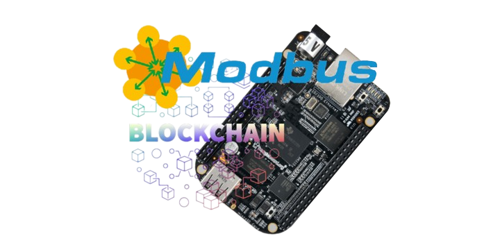

# Modbus2Chain

Modbus2Chain is an IoT project that uses the Modbus protocol to acquire environmental data and send it securely to the blockchain through a serial connection. The goal is to create an efficient system for collecting and sharing critical environmental data and keeping track of it through the blockchain.
